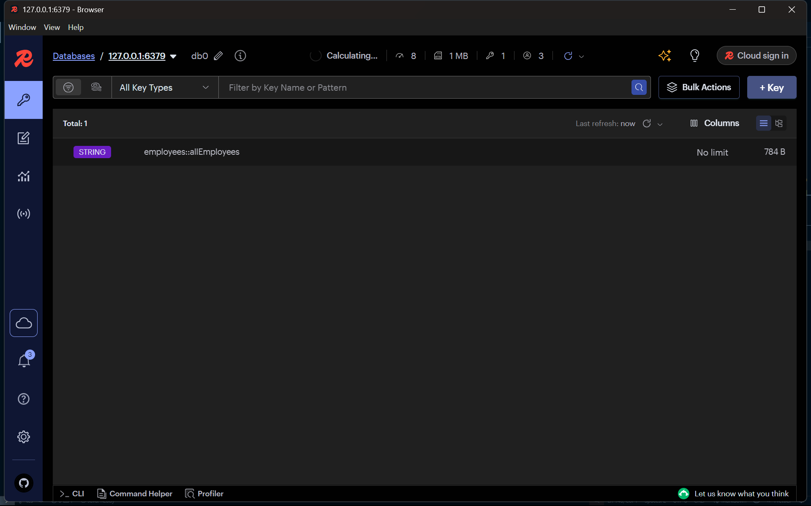
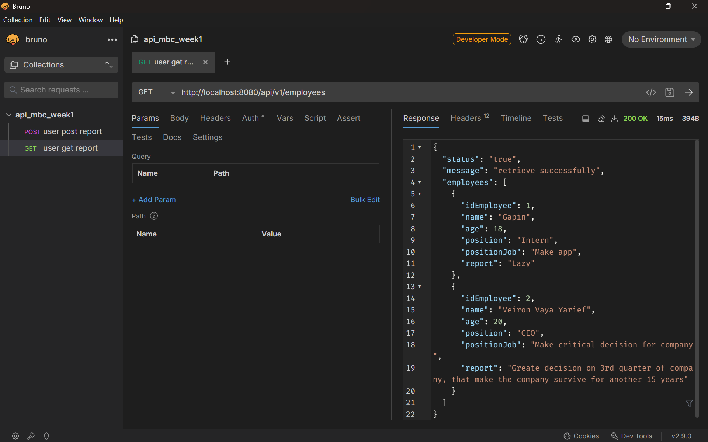

<p align="center">
  
</p>

# MBC Laboratory Week 1 by Veiron Vaya Yarief 

# Table of Contents
- [MBC Laboratory Week 1 by Veiron Vaya Yarief](#mbc-laboratory-week-1-by-veiron-vaya-yarief)
- [Table of Contents](#table-of-contents)
  - [1. Docker Facts](#1-docker-facts)
    - [1.1 Difference between running on Compose and Stack](#11-difference-between-running-on-compose-and-stack)
      - [1.1.1 Communication](#111-communication)
      - [1.1.2 Features](#112-features)
    - [1.2. Redis cache on Compose and Stack](#12-redis-cache-on-compose-and-stack)
    - [1.3. What happend to cache data if Redis container deleted?](#13-what-happend-to-cache-data-if-redis-container-deleted)
    - [1.4. Docker Compose on Docker Swarm](#14-docker-compose-on-docker-swarm)
  - [2. Project Structure](#2-project-structure)
  - [3. Architecture \& System-Flow](#3-architecture--system-flow)
    - [3.1. Architecture](#31-architecture)
      - [3.1.1 Backend](#311-backend)
      - [3.1.2. Frontend](#312-frontend)
      - [3.1.3. Docker](#313-docker)
    - [3.2. System-FLow](#32-system-flow)
  - [4. Development Process](#4-development-process)
  - [5. Documentation](#5-documentation)

## 1. Docker Facts

### 1.1 Difference between running on Compose and Stack

There is some important aspect to look through this topic

#### 1.1.1 Communication

  - Compose is a simple multi-container orchestration where the containers communicate with eachother by exposing their port in the same network using **bridge** type network. 
  - While Stack is a complex multi-container orchestration where containers communicate with eachother using **overlay** network, this enable multiple node and their own purpose on the schema.

#### 1.1.2 Features 

  - Swarm give better orchestration on another level, like making replicas and how large system communicate through **overlay** netwrok.
  - Docker secrets can only be utilize in swarm mode, because it stored the password encrypted in one file under /run/secrets. 


### 1.2. Redis cache on Compose and Stack

  Redis as a storage and in this application we can simplify it as caching, where it store data in RAM, theres nothing difference between the functionality but in swarm redis can work accross multiple node and the redis password can be stored in docker secrets.

### 1.3. What happend to cache data if Redis container deleted?

  When we use Redis it will store data in RAM, when we delete the container the memory is released and cache data gone also when we shutdown the computer because its volatile or in this application when we hit `POST API` because it will do `CacheEvict` where it will delete invalid cache.

### 1.4. Docker Compose on Docker Swarm

  Docker swarm deploy is using `compile.yaml` file and docker auto read these files so, Docer Compose is Utilized in Swarm mode.

## 2. Project Structure

```
MBC_WEEK1/
├── backend/                          # Spring Boot Backend
│   ├── src/
│   │   └── main/
│   │       ├── java/com/example/.../
│   │       │   ├── controller/       # Controllers (handle HTTP requests)
│   │       │   ├── dto/              # Data Transfer Objects
│   │       │   ├── entity/           # JPA Entities (models)
│   │       │   ├── mapper/           # Mappers for DTO <-> Entity
│   │       │   ├── repository/       # Spring Data JPA Repositories
│   │       │   ├── security/         # Security configuration (JWT, etc.)
│   │       │   ├── service/          # Business logic
│   │       │   └── BackendApplication.java # Main Spring Boot app
│   │       └── resources/
│   │           ├── database/
│   │           │   ├── dummy.sql     # Sample SQL data
│   │           │   └── schema.sql    # Schema definition
│   │           └── application.yaml  # Spring Boot config
│   ├── target/                       # Build output directory
│   ├── pom.xml                       # Maven build file
│   └── Dockerfile                    # Dockerfile for backend
│
├── docker/                           # Docker and Redis config
│   ├── redis/
│   │   ├── redis.conf                # Redis configuration
│   │   └── secrets/                  # Sensitive data for docker secrets
│   └── docker-compose.yml            # Compose file for services
│
├── frontend/                         # React-based frontend
│   ├── src/
│   │   ├── components/               # UI components
│   │   ├── layouts/                  # Layout components (navbar, footer)
│   │   ├── pages/                    # Page views
│   │   ├── App.jsx                   # Main App component
│   │   ├── index.js                  # Entry point
│   ├── Dockerfile                    # Dockerfile for frontend
│   ├── tailwind.config.js           # Tailwind configuration
│   └── package.json                 # NPM dependencies
|
└── README.md                        # Project overview

```

## 3. Architecture & System-Flow

### 3.1. Architecture


#### 3.1.1 Backend 

- Springboot: Clean and clear backend code with tools that help backend development, and support contenarization so does docker secrets using: `spring.config.import:optional:configtree:/run/secrets/`. and utilize greate cache manager combine with Redis.

- MySQL: Basic RDMS to handle data process and storage.
- Redis: Caching storage.

#### 3.1.2. Frontend

- React Js: Familiarization javascript interface.

#### 3.1.3. Docker

- Containerization: Wrap an application into a container.
- Compose: Run multiple container.
- Swarm/Stack: Orchestrate multiple container and nodes.
- Secrets: Help securing data with keep the credential hidden.

### 3.2. System-FLow 


## 4. Development Process


1. Start with architecteru design that thinks about many aspect and create architecture design and the system flow
2. Develop backend with clean code and security consideration using REST API, configuration with redis and mysql for data storage.
3. Develop frontend for ui and human interaction.
4. Contenarization backend Springboot https://spring.io/guides/gs/spring-boot-docker :
- Navigate to backend root directory
- Build jar. file: `./mvnw clean package`
- Make Dockerfile in root directory
```dockerfile
FROM openjdk:21-jdk-slim
ARG JAR_FILE=target/*.jar
COPY ${JAR_FILE} backend-0.0.1-SNAPSHOT.jar
ENTRYPOINT ["java","-jar","backend-0.0.1-SNAPSHOT.jar"]
```
- Build docker image: `docker build -t <your_repo_name>:<your_tag_name> .`
- Run: `docker images` to check ur images
   
5. Contenarization frontend React https://www.docker.com/blog/how-to-dockerize-react-app/ :
- Navigate to frontend root directory
- Create Dockerfile
```dockerfile
# Use the latest LTS version of Node.js
FROM node:18-alpine

# Set the working directory inside the container
WORKDIR /app

# Copy package.json and package-lock.json
COPY package*.json ./

# Install dependencies
RUN npm install

# Copy the rest of your application files
COPY . .

# Expose the port your app runs on
EXPOSE 3000

# Define the command to run your app
CMD ["npm", "start"]
```
- Build docker image: `docker build -t my-react-app .`
  
6. Make simple `compose.yaml` on root directory to run multiple container (backend,mysql,redis):
- Create a directory for docker `./docker/`
```yaml
networks:
  backend:
    driver: bridge
services:
  mysql:
    image: mysql:oraclelinux9
    networks:
      - backend
    environment:
      MYSQL_ROOT_PASSWORD: password
      MYSQL_DATABASE: employee_db
  backend:
    depends_on:
      - mysql
    image: backend:0.0.2-SNAPSHOT
    networks:
      - backend
    environment:
      SPRING_DATASOURCE_URL:      jdbc:mysql://mysql:3306/employee_db?createDatabaseIfNotExist=true
      SPRING_DATASOURCE_USERNAME: root
      SPRING_DATASOURCE_PASSWORD: password
    ports:
      - 8080:8080
```
- run: `compose up` in docker file directory
  
7. Activate SWARM mode to manage multiple node and service https://docs.docker.com/engine/swarm/swarm-tutorial/ :
- run: `docker swarm init`
- update compose.yaml file:
```yaml
version: "3.8"

services:
  mysql:
    image: mysql:oraclelinux9
    environment:
      MYSQL_ROOT_PASSWORD: password
      MYSQL_DATABASE: employee_db

  redis:
    image: redis:alpine3.22
    ports:
      - 6379:6379 
    command: ["redis-server","/etc/redis/redis.conf"]        
    volumes:
      - ./redis/redis.conf:/etc/redis/redis.conf
  backend:
    depends_on:
      - mysql
      - redis                 
    image: backend:0.0.10-SNAPSHOT
    environment:
      DATASOURCE_URL: jdbc:mysql://mysql:3306/employee_db?createDatabaseIfNotExist=true
      DATASOURCE_USERNAME: root
      DATASOURCE_PASSWORD: password


      REDIS_HOST: redis
      REDIS_PORT: 6379

    secrets:
      - redis_pass

    ports:
      - 8080:8080

  frontend:
    depends_on:
      - backend
    image: frontend:latest
    ports:
      - 3000:3000

secrets:
  redis_pass:
    file: ./secrets/redis_pass.txt
```
- run: `docker stack deploy --compose-file compose.yaml <your_stack_name>`
- run: `docker service ls` to check your stack 
8. Implement docker secrets:

- make secrets folder `docker/secrets/` and file `redis_pass.txt`
```yaml
requirepass <your_password>
#aclfile /etc/redis/users.acl
```
- go to redish insight insert the password
- add this code into backend application.yaml for springboot reading the docker secret
```yaml
spring:
  config:
    import: optional:configtree:/run/secrets/
```
- run: `docker stack deploy --compose-file compose.yaml <your_stack_name>`


## 5. Documentation

.png>)
.png>)




